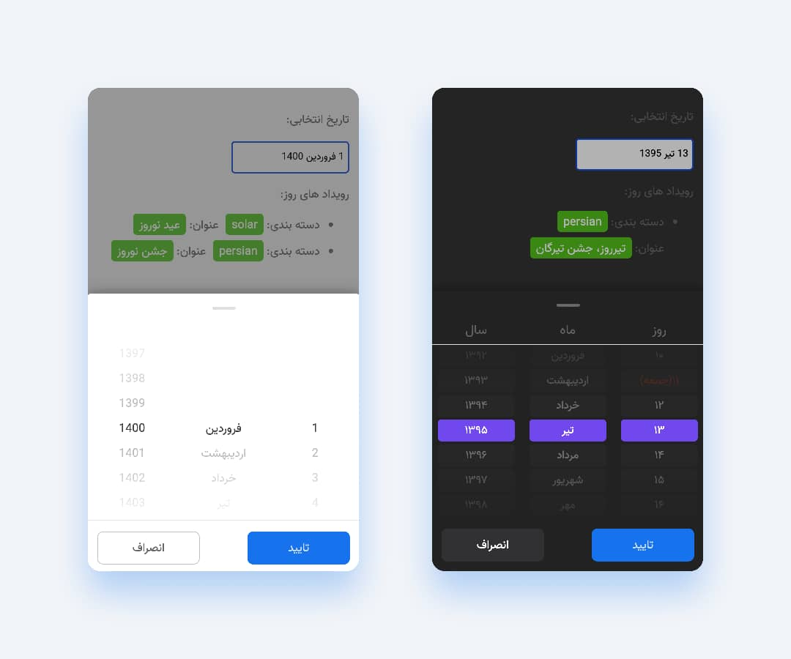

# Persian Mobile Date and Time picker

This library provides a component that can set year, month, day, hour, minute and second by sliding up or down.

- `Note`:
  There is no need to use the `moment-jalaali` or any other Jalali libraries and All details and functions are further explained in the [Date helpers](#date-helpers) section and if you need a function that we don't have, let us know to implement it.

### Demo

All functionalities and demos have documented here: [Live Demo](https://persian-tools.github.io/persian-mobile-datepicker)

## Theme

<div style="padding:30px;display:flex; flex-direction:row; justify-content: space-between">
    

</div>

## Getting Started

### Install

Using [npm](https://www.npmjs.com/):

    $ npm install --save @persian-tools/persian-mobile-datepicker

Using [yarn](https://yarnpkg.com):

    $ yarn add --save @persian-tools/persian-mobile-datepicker

### Import what you need

The following guide assumes you have some sort of ES2015 build set up using babel and/or webpack/browserify/gulp/grunt/etc.

1. Import functions, helpers and Types

```javascript
import {
  Picker,
  format,
  newDate,
  DatePickerConfig,
} from '@persian-tools/persian-mobile-datepicker';
```

2. Create Picker Configuration model

```javascript
const config: DatePickerConfig = {
  year: {
    caption: {
      text: 'سال',
    },
  },
  month: {
    caption: {
      text: 'ماه',
    },
  },
  day: {
    caption: {
      text: 'روز',
    },
  },
};
```

3. Use **Picker** component

```JSX
const App = () => {
  const [showPicker, setShowPicker] = React.useState(true);
  const [selectedDateValue, setSelectedDateValue] = React.useState();
  const [selectedDateEvents, setSelectedDateEvents] = React.useState([]);

  function handleSubmit(selectedDate) {
    const date = format(selectedDate.date, "d MMMM yyyy");
    const events = selectedDate.events;

    setSelectedDateValue(date);
    setSelectedDateEvents(events);
  }

  return <Picker
    isOpen={showPicker}
    config={config}
    minDate={newDate({ year: 1399, month: 9, day: 11 })}
    maxDate={newDate({ year: 1400, month: 1, day: 13 })}
    onSubmit={handleSubmit}
    onChange={handleSubmit}
    onClose={() => setShowPicker(false)}
    highlightWeekends
  />
  }
```

[Live Example](https://codesandbox.io/s/persian-mobile-datepicker-initialization-5o87t)

### Props

| Property               | Rquired | Type                                                                  | Description                                                                                                                       |
| :--------------------- | :------ | :-------------------------------------------------------------------- | :-------------------------------------------------------------------------------------------------------------------------------- |
| isOpen                 | Yes     | boolean                                                               | Picker open status                                                                                                                |
| theme                  | No      | string                                                                | Picker Theme                                                                                                                      |
| config                 | Yes     | [DatePickerConfig](#datepickerconfig)                                 | configuration of datepicker                                                                                                       |
| classNamePrefix        | No      | string                                                                | className of the datepicker                                                                                                       |
| initialValue           | No      | Date                                                                  | initial date of datepicker                                                                                                        |
| value                  | No      | [WheelPickerSelectEvent](#wheelpickerselectevent)                     | value of datepicker                                                                                                               |
| title                  | No      | string                                                                | title of datepicker                                                                                                               |
| onChange               | No      | (selected: [WheelPickerSelectEvent](#wheelpickerselectevent)) => void | Gets called when value of the picker changes                                                                                      |
| onSubmit               | No      | (selected: [WheelPickerSelectEvent](#wheelpickerselectevent)) => void | Triggered when you click on Submit button                                                                                         |
| onCancel               | No      | () => void                                                            | Call when user clicked on Cancel Button                                                                                           |
| onClose                | No      | () => void                                                            | Call when Picker Sheet modal has closed or User clicked on Cancel Button or User manually closed the Sheet modal by drag and drop |
| minDate                | No      | Date                                                                  | Specifies the minimum selectable day by user                                                                                      |
| maxDate                | No      | Date                                                                  | Specifies the maximum selectable day by user                                                                                      |
| endYear                | No      | number                                                                | The Minimum selectable year(Picker will calculate the `StartYear` by this approach: `currentYear` + `startYear`)                  |
| startYear              | No      | number                                                                | The Maximum selectable year(Picker will calculate the `StartYear` by this approach: `currentYear` + `startYear`)                  |
| addDayName             | No      | boolean                                                               | Add the name of the day of the week                                                                                               |
| highlightWeekends      | No      | boolean                                                               | Determines whether to mark weekend days with red or not. (weekend day is Friday)                                                  |
| highlightHolidays      | No      | boolean                                                               | Determines whether to mark holidays in day column.                                                                                |
| height                 | No      | number                                                                | Height of Picker Sheet modal                                                                                                      |
| submitText             | No      | string                                                                | Submit button text                                                                                                                |
| cancelText             | No      | string                                                                | Cancel button text                                                                                                                |
| showCancelButton       | No      | boolean                                                               | Display Cancel button                                                                                                             |
| disableSheetDrag       | No      | boolean                                                               | Disable drag for the sheet content                                                                                                |
| disableSheetHeaderDrag | No      | boolean                                                               | Disable drag for the sheet header                                                                                                 |

## Custom date unit

set `config` to configure year, month, day.

```javascript
config = {
  year: {
    caption: {
      text: 'سال',
    },
  },
  month: {
    caption: {
      text: 'ماه',
    },
  },
  day: {
    caption: {
      text: 'روز',
    },
  },
};
```

## datePickerConfig

```js
[key in DateConfigTypes]: DateConfigValuesModel

```

where the DateConfigTypes is one of `"year", "month", "day", "hour", "minute", "second"`

## Picker config Object Dto

| Property          | Type          | Description                                                                                                |
| :---------------- | :------------ | :--------------------------------------------------------------------------------------------------------- |
| caption           | Object        | an object with the props text `string` and style `CSSProperties` regular react style object                |
| formatter         | Function      | a function of [ PickerExtraDateInfo ](#PickerExtraDateInfo) to format every columns item text              |
| classname         | Function      | a function of [ PickerExtraDateInfo ](#PickerExtraDateInfo) for specifying the classNames                  |
| shouldRender      | Function      | a function of [ PickerExtraDateInfo ](#PickerExtraDateInfo) to specify which functionalities should render |
| columnStyle       | CSSProperties | the inline style of columns of datepicker                                                                  |
| itemStyle         | CSSProperties | the inline style of each of cell items                                                                     |
| selectedItemStyle | CSSProperties | the inline style of selected cell item                                                                     |

## WheelPickerSelectEvent

| Property | Type            | Description                                                                                 |
| :------- | :-------------- | :------------------------------------------------------------------------------------------ |
| object   | PickerDateModel | an object with the props text `string` and style `CSSProperties` regular react style object |
| events   | Array           | the array of events                                                                         |
| date     | Date            | the value of date                                                                           |

## PickerExtraDateInfo

| Property    | Type    | Description                                                                                                            |
| :---------- | :------ | :--------------------------------------------------------------------------------------------------------------------- |
| weekDay     | number  | the number of day of week                                                                                              |
| weekDayText | string  | can have these values: `شنبه , یک‌شنبه , دو‌شنبه , سه‌شنبه , چهار‌شنبه , پنج‌شنبه , جمعه` or other names if you prefer |
| monthText   | string  | is the text of months for e.g. `فروردین`                                                                               |
| dayOfYear   | number  | number of day in a year                                                                                                |
| isLeapYear  | boolean | whether the year is a leap year or not                                                                                 |
| isHoliday   | boolean | whether the day is a holiday or not                                                                                    |
| year        | number  | current year                                                                                                           |
| month       | number  | current month                                                                                                          |
| day         | number  | current day                                                                                                            |
| hour        | number  | current hour                                                                                                           |
| minute      | number  | current minute                                                                                                         |
| second      | number  | current second                                                                                                         |

## Usage Examples

### Changing the months text

You can do it with the help of formatter props of month in config

```javascript
{
  year: {
    caption: {
      text: "سال",
    }
  },
  month: {
    caption: {
      text: "ماه",
    },
    formatter: ({ month, monthText }) => (month === 5 ? "امرداد" : monthText),
  },
  day: {
    caption: {
      text: "روز",
    }
  }


```

<div style="padding:30px">
  
</div>

### Removing a day

If for whatever reason you want to remove some cells you can do so with the use of `shouldRender`

the following config code will remove the 6th day of 3rd month

```javascript
{
  year: {
    caption: {
      text: "سال",
    }
  },
  month: {
    caption: {
      text: "ماه",
    }
  },
  day: {
    caption: {
      text: "روز",
    },
    shouldRender: ({ month, day }) => !(month === 3 && day === 6),
  }

```

<div style="padding:30px">
  
</div>

### Styling columns

If you want to change the inline style of columns or cells of datepicker you can use `columnStyle`, `itemStyle` and `selectedItemStyle`

```javascript
{
  year: {
    caption: {
      text: "سال",
    },
  },
  month: {
    caption: {
      text: "ماه",
    },
    columnStyle: { background: "#aaa", color: "green" },
    itemStyle: { color: "green" },
    selectedItemStyle: { color: "blue" },
  },
  day: {
    caption: {
      text: "روز",
    },
  }

```

<div style="padding:30px">
  
</div>

### Date helpers

- `newDate`: Convert Jalaali Date to Gregorian and returns a Date instance

```javascript
import { newDate } from '@persian-tools/persian-mobile-datepicker';

newDate({
  year: 1400,
  month: 1,
  day: 1,
}); // Sun Mar 21 2021 00:00:00 GMT+0330 (Iran Standard Time)
```

- `convertDateInstanceToDateObject`: Convert entered date to an object

```javascript
import { convertDateInstanceToDateObject } from '@persian-tools/persian-mobile-datepicker';

convertDateInstanceToDateObject(new Date()); // { year: 1400, month: 5, day: 15, hour: 22, minute: 20,second: 10 }
```

- `daysInMonth`: Get the number of days in a month of a year

```javascript
import { daysInMonth } from '@persian-tools/persian-mobile-datepicker';

daysInMonth(1400, 1); // 31
daysInMonth(1399, 12); // 30 -> 1399 is a leap year
daysInMonth(1400, 12); // 29
```

- `getWeekDay`: Get the day of the week of the given date. Returns number starts from 0, 0 means the first day of Week and 6 means the last day of Week

```javascript
import { getWeekDay } from '@persian-tools/persian-mobile-datepicker';

getWeekDay(1400, 5, 15); // 6
```

- `getDayOfYear`: Get the day of the year of the given date.

```javascript
import { getDayOfYear } from '@persian-tools/persian-mobile-datepicker';

getDayOfYear(1400, 5, 15); // 139
```

- `isWeekend`: Return true if the Date is at the Weekend

```javascript
import { isWeekend } from '@persian-tools/persian-mobile-datepicker';

isWeekend(1400, 5, 22); // true -> because it is friday
isWeekend(1400, 5, 23); // false -> it is Saturday
```

- `getWeekDayText`: Get Name the days of the week

```javascript
import { getWeekDayText } from '@persian-tools/persian-mobile-datepicker';

getWeekDayText(1400, 5, 22); // جمعه
getWeekDayText(1400, 5, 23); // شنبه
```

- `isValidJalaaliDate`: Is the given Jalaali date valid?

```javascript
import { isValidJalaaliDate } from '@persian-tools/persian-mobile-datepicker';

isValidJalaaliDate(1399, 12, 30); // true -> because 1399 is leap
isValidJalaaliDate(1400, 12, 30); // false
```

- `isBefore`: Is the first date before the second one?

```javascript
import { isBefore, newDate } from '@persian-tools/persian-mobile-datepicker';

const firstDate = newDate(1399, 12, 30);
const secondtDate = newDate(1400, 2, 1);

isBefore(firstDate, secondtDate); // true
```

- `isAfter`: Is the first date after the second one?

```javascript
import { isAfter, newDate } from '@persian-tools/persian-mobile-datepicker';

isAfter(newDate(1361, 10, 10), newDate(1372, 10, 10)); // false
isAfter(newDate(1372, 10, 10), newDate(1361, 10, 10)); // false
```

- `format`: Returns the formatted date string in the given format. The result may vary by locale.
[See Accepted patterns](https://date-fns.org/v2.23.0/docs/format)
```javascript
import { format } from '@persian-tools/persian-mobile-datepicker';

format(new Date('2020-10-10'), 'yyyy/MM/dd'); // 1399/07/19
```

- `isEqual`: Are the given dates equal?

```javascript
import { isEqual, newDate } from '@persian-tools/persian-mobile-datepicker';

isEqual(newDate(1361, 10, 10), newDate(1372, 10, 10)); // false
isEqual(newDate(1361, 10, 10), newDate(1361, 10, 10)); // true
```

- `getCurrentYear`: Get the year of the current date.

```javascript
import { getCurrentYear } from '@persian-tools/persian-mobile-datepicker';

getCurrentYear(); // 1400
```

- `currentDateObject`: Converts date instance to an object.

```javascript
import { currentDateObject } from '@persian-tools/persian-mobile-datepicker';

currentDateObject(); // {day: 16, hour: 5, minute: 51, month: 5, second: 1, year: 1400}
```

- `isLeapYear`: Check if the entered year is Leap

```javascript
import { isLeapYear } from '@persian-tools/persian-mobile-datepicker';

isLeapYear(1399); // true
isLeapYear(1400); // false
```

## Roadmap

- [ ] Add hour, minute and seconds
- [ ] Implement react native component
