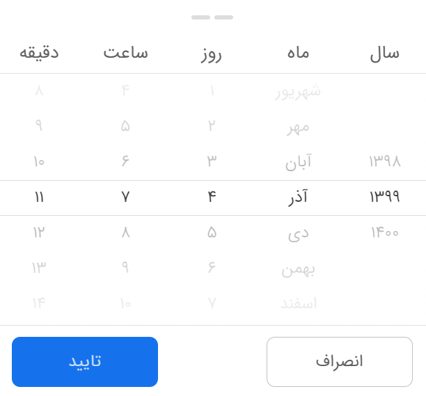
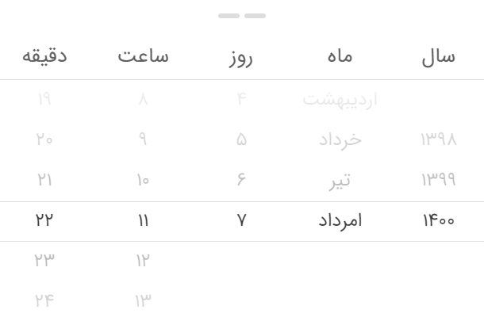
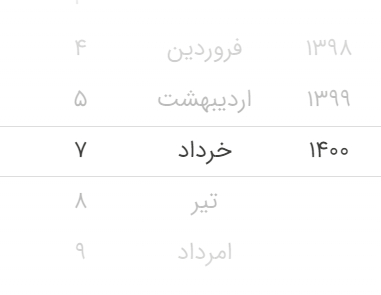
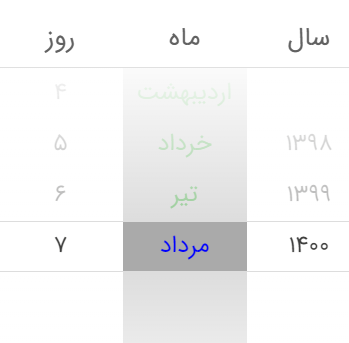

# persian-mobile-datepicker

Persian Mobile Date and Time picker

persian-mobile-datepicker provides a component that can set year, month, day, hour, minute and second by sliding up or down.

## Theme

### android-light

<div style="padding:30px">
  
</div>

## Getting Started

### Install

Using [npm](https://www.npmjs.com/):

    $ npm install @persian-tools/persian-mobile-datepicker --save

### Import what you need

The following guide assumes you have some sort of ES2015 build set up using babel and/or webpack/browserify/gulp/grunt/etc.

```javascript
import {
  Picker,
  DateConfigValuesModel,
  DateConfigTypes,
} from '@persian-tools/persian-mobile-datepicker';
```

```javascript
const config: Partial<Record<DateConfigTypes, DateConfigValuesModel>> = {
  year: {
    caption: {
      text: 'سال',
    },
  },
  month: {
    caption: {
      text: 'ماه',
    },
  },
  day: {
    caption: {
      text: 'روز',
    },
  },
  hour: {
    caption: {
      text: 'ساعت',
    },
  },
  minute: {
    caption: {
      text: 'دقیقه',
    },
  },
};
```

```JSX
const App = () => {
  return <Picker
    config={config}
    minDate={sub(new Date(), { years: 2 })}
    maxDate={new Date()}
    onSubmit={handleSubmit}
    isOpen={showPicker}
    highlightWeekends
    />
  }
```

### PropTypes

| Property          | Type                                                                  | Default | Description                                                                                                      |
| :---------------- | :-------------------------------------------------------------------- | :------ | :--------------------------------------------------------------------------------------------------------------- |
| config            | [DatePickerConfig](#datepickerconfig)                                 | {}      | configuration of datepicker                                                                                      |
| classNamePrefix   | string                                                                | -       | className of the datepicker                                                                                      |
| initialValue      | Date                                                                  | -       | initial date of datepicker                                                                                       |
| value             | [WheelPickerSelectEvent](#wheelpickerselectevent)                     | -       | value of datepicker                                                                                              |
| title             | string                                                                | -       | title of datepicker                                                                                              |
| onChange          | (selected: [WheelPickerSelectEvent](#wheelpickerselectevent)) => void | -       | Gets called when value of the picker changes                                                                     |
| minDate           | Date                                                                  | null    | Specifies the minimum selectable day by user                                                                     |
| maxDate           | Date                                                                  | null    | Specifies the maximum selectable day by user                                                                     |
| endYear           | number                                                                | 30      | The Minimum selectable year(Picker will calculate the `StartYear` by this approach: `currentYear` + `startYear`) |
| startYear         | number                                                                | 30      | The Maximum selectable year(Picker will calculate the `StartYear` by this approach: `currentYear` + `startYear`) |
| highlightWeekends | boolean                                                               | false   | Determines whether to mark weekend days with red or not. (weekend day is Friday)                                 |
| highlightHolidays | boolean                                                               | false   | Determines whether to mark holidays in day column.                                                               |

## Custom date unit

set `config` to configure year, month, day.

```javascript
config = {
  year: {
    caption: {
      text: 'سال',
    },
  },
  month: {
    caption: {
      text: 'ماه',
    },
  },
  day: {
    caption: {
      text: 'روز',
    },
  },
};
```

## datePickerConfig

```js
[key in DateConfigTypes]: DateConfigValuesModel

```

where the DateConfigTypes is one of `"year", "month", "day", "hour", "minute", "second"`

## DateConfigValuesModel

| Property          | Type          | Default  | Description                                                                                                |
| :---------------- | :------------ | :------- | :--------------------------------------------------------------------------------------------------------- |
| caption           | Object        | true     | and object with the props text `string` and style regular react style object                               |
| formatter         | Function      | () => {} | a function of [ PickerExtraDateInfo ](#pickerextradateinfo) to format the date                             |
| classname         | Function      | () => {} | a function of [ PickerExtraDateInfo ](#pickerextradateinfo) for specifiying the classNames                 |
| shouldRender      | Function      | () => {} | a function of [ PickerExtraDateInfo ](#pickerextradateinfo) to specify which functionalities should render |
| columnStyle       | CSSProperties | -        | the inline style of columns of datepicker                                                                  |
| itemStyle         | CSSProperties | -        | the inline style of each of cell items                                                                     |
| selectedItemStyle | CSSProperties | -        | the inline style of selected cell item                                                                     |

## WheelPickerSelectEvent

| Property | Type            | Default | Description                                                                  |
| :------- | :-------------- | :------ | :--------------------------------------------------------------------------- |
| object   | PickerDateModel | true    | and object with the props text `string` and style regular react style object |
| events   | Array           | []      | the array of events                                                          |
| date     | Date            | -       | the value of date                                                            |

## PickerExtraDateInfo

| Property    | Type    | Default               | Description                                                                                                            |
| :---------- | :------ | :-------------------- | :--------------------------------------------------------------------------------------------------------------------- |
| weekDay     | number  | true                  | the number of day of week                                                                                              |
| weekDayText | string  | the text of week days | can have these values: `شنبه , یک‌شنبه , دو‌شنبه , سه‌شنبه , چهار‌شنبه , پنج‌شنبه , جمعه` or other names if you prefer |
| monthText   | string  | ""                    | is the text of months for e.g. `فروردین`                                                                               |
| dayOfYear   | number  | -                     | number of day in a year                                                                                                |
| isLeapYear  | boolean | -                     | whether the year is a leap year or not                                                                                 |
| isHoliday   | boolean | -                     | whether the day is a holiday or not                                                                                    |
| year        | number  | -                     | current year                                                                                                           |
| month       | number  | -                     | current month                                                                                                          |
| day         | number  | -                     | current day                                                                                                            |
| hour        | number  | -                     | current hour                                                                                                           |
| minute      | number  | -                     | current minute                                                                                                         |
| second      | number  | -                     | current second                                                                                                         |

## Usage Examples

### Changing the months text

You can do it with the help of formatter props of month in config

```javascript
{
  year: {
    caption: {
      text: "سال",
    },
  },
  month: {
    caption: {
      text: "ماه",
    },
    formatter: ({ month, monthText }) => (month === 5 ? "امرداد" : monthText),
  },
  day: {
    caption: {
      text: "روز",
    },
  },
  hour: {
    caption: {
      text: "ساعت",
    },
  },
  minute: {
    caption: {
      text: "دقیقه",
    },
  }

```

<div style="padding:30px">

</div>

### Removing a day

If for whatever reason you want to remove some cells you can do so with the use of `shouldRender`

the following config code will remove the 6th day of 3rd month

```javascript
{
  year: {
    caption: {
      text: "سال",
    },
  },
  month: {
    caption: {
      text: "ماه",
    },
  },
  day: {
    caption: {
      text: "روز",
    },
    shouldRender: ({ month, day }) => !(month === 3 && day === 6),
  },
  hour: {
    caption: {
      text: "ساعت",
    },
  },
  minute: {
    caption: {
      text: "دقیقه",
    },
  }

```

<div style="padding:30px">

</div>

### Styling columns

If you want to change the inline style of columns or cells of datepicker you can use `columnStyle`, `itemStyle` and `selectedItemStyle`

```javascript
{
  year: {
    caption: {
      text: "سال",
    },
  },
  month: {
    caption: {
      text: "ماه",
    },
    columnStyle: { background: "#aaa", color: "green" },
		itemStyle: { color: "green" },
		selectedItemStyle: { color: "blue" },
  },
  day: {
    caption: {
      text: "روز",
    },
  },
  hour: {
    caption: {
      text: "ساعت",
    },
  },
  minute: {
    caption: {
      text: "دقیقه",
    },
  }

```

<div style="padding:30px">

</div>

## Roadmap

- [ ] Add hour, minute and seconds
- [ ] Implement react native component
